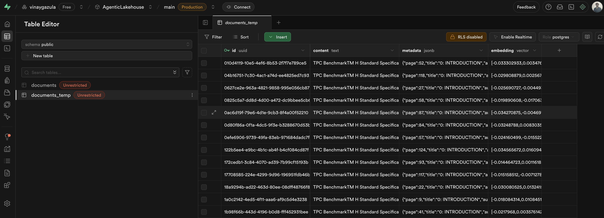

# AgenticLakehouse: A Multi-Agent System for Databricks

Welcome to the AgenticLakehouse! This project is an agentic application built using **LangGraph** designed to interact directly with your Databricks Workspace. It provides a conversational interface (built with **Gradio**) to query Unity Catalog tables, retrieve information from documents, and browse the web.

The application is built for rapid prototyping and deployment, running seamlessly as a **Databricks App**.

## Architecture

The core of this application is a multi-agent workflow orchestrated by **LangGraph**. A central router agent assesses the user's request and routes it to the most appropriate specialist agent:

* **Spark SQL Agent:** Interacts with Databricks Unity Catalog tables under a given `catalog` and `schema`. It uses the LangChain Spark SQL Toolkit to construct and execute queries against a Databricks Serverless SQL warehouse.
* **RAG Agent:** Performs Retrieval-Augmented Generation. It sources documents from Unity Catalog Volumes, retrieves relevant chunks from a **Supabase** (PostgreSQL) vector store, and synthesizes an answer. *(Note: This workflow is still a work in progress).*
* **Web Search Agent:** Uses the Tavily API to answer general knowledge or web-based questions.

### High-Level Diagram


### LangGraph Workflow (As of Now)

The agentic workflow is defined as a graph, with the router acting as the primary conditional entry point.


## Key Features

* **Databricks Unity Catalog Interaction:** Directly query your UC tables using natural language via Databricks Serverless Compute.
* **RAG on Lakehouse:** Implements a RAG pipeline using documents stored in Unity Catalog Volumes, demonstrating how to keep your data and retrieval sources within the Databricks ecosystem.
* **Flexible LLM Support:** Easily configure the application to use various LLM providers:
    * **Groq API** (fast inference)
    * **Ollama** (using cloud-served models like `gpt-oss:120b-cloud`)
    * Easily adaptable to **OpenAI** or other LangChain-compatible models.
* **Cost-Effective Replication:** This entire stack can be **run for free** using:
    * Databricks Free Edition (or an existing workspace)
    * Supabase Free Tier (as a vector store)
    * Groq Free Tier or Ollama (for local implementation)
    * Langsmith Free Tier (for observability)
* **Rapid Prototyping:** Built with Gradio for a simple UI, perfect for quick iteration and deployment on Databricks Apps.

## Tech Stack

* **Orchestration:** LangGraph
* **Framework:** LangChain
* **Platform:** Databricks (Unity Catalog, Serverless Compute, UC Volumes, Databricks Apps)
* **UI:** Gradio
* **Vector Store:** Supabase (Can be replaced with **Databricks Lakebase**, which is also based on Postgres)
* **LLMs:** Groq (or) Ollama (**OpenAI** can be implemented if API key is available)
* **Web Search:** Tavily
* **Observability:** LangSmith

## Getting Started: Local Setup

You can run the Gradio application locally to test and develop.

### 1. Prerequisites

You will need accounts/access for the following services:
* **Databricks Workspace:** With a Serverless SQL Warehouse set up.
* **Supabase:** A free project for the vector store.
* **Groq:** An API key for LLM access.
* **Tavily:** An API key for web search.
* **LangSmith (Recommended):** An API key for tracing and debugging.

### 2. Clone the Repository

```bash
git clone git@github.com:vinay-ram1999/AgenticLakehouse.git
cd AgenticLakehouse
```

### 3. Set Up Environment Variables

Create a `.env` file in the root of the project and add the following variables:

```bash
# Databricks
DATABRICKS_HOST="https://dbc-xyz.cloud.databricks.com"
DATABRICKS_CLIENT_ID="ed..."
DATABRICKS_CLIENT_SECRET="do..."
DATABRICKS_SERVERLESS_COMPUTE_ID="auto"

UC_CATALOG_NAME="catalog_name..."
UC_SCHEMA_NAME="schema_name..."

# LLM Provider (Choose one or both)
GROQ_API_KEY="gsk_..."

# If running Ollama locally
OLLAMA_HOST="http://localhost:11434" 
OLLAMA_PORT="11434"

# Embedding model
GOOGLE_API_KEY="AIz..."

# Supabase (Vector Store)
SUPABASE_URL="https://imbjdwlexwuhdxfqq.supabase.co"
SUPABASE_KEY="sb_secret_..."

# Tool APIs
TAVILY_API_KEY="tvly-..."

# Observability (Recommended)
LANGSMITH_TRACING="true"
LANGSMITH_ENDPOINT="https://api.smith.langchain.com"
LANGSMITH_API_KEY="lsv2_..."
LANGSMITH_PROJECT="AgenticLakehouse (DEV)"
```

### 4. Set Up Supabase
Connect to your Supabase project's SQL editor and run the scripts found in the `supabase/` directory (`DDL_langchain.sql` (Recommended) or `DDL_with_index.sql`) to set up the necessary tables and vector extension.

### 5. Install Dependencies and Run the Apllication
This project uses `uv` for fast package management, but `pip` works as well.

**Using `uv` (Recommended):**

```bash
# Install uv if you don't have it
curl -LsSf https://astral.sh/uv/install.sh | sh

# Create a virtual environment and install packages
uv venv
source .venv/bin/activate
uv pip install -r requirements.txt

# Run the Application
uv run python main.py
```

**Using `pip`:**

```bash
python -m venv .venv
source .venv/bin/activate
pip install -r requirements.txt

# Run the Application
python main.py
```

The Gradio app will now be running on `http://127.0.0.1:7860`.

## Future Plans

The long-term vision is to create a fully integrated, live "Lakehouse Agent" for the Databricks Workspace.

* Allow users to select `catalog` and `schema` in the frontend before starting a chat/coversation (similar to Genie).
* Reduce Spark query latency by allocating a dedicated compute cluster instead of using serverless compute if you know the application is used widely. 
* Move Beyond Spark SQL: The current reliance on executing Spark SQL queries for metadata (e.g., "list tables") is a bottleneck. The next step is to leverage the Unity Catalog REST API directly, potentially maintaining an `MCP-server` for the agent to access all schema and metadata instantly.
* MLFlow Integration: Extend the agent's capabilities to interact with MLFlow, allowing users to ask questions about model performance, compare runs, identify best-performing models, or retrieve feature importance.
* Databricks Jobs Monitoring: Integrate with the Databricks Jobs API to enable monitoring, debugging, and optimization suggestions for your production pipelines.
* Build an autonomous agent that periodically processes the entire Lakehouse metadata using the `MCP-server` and build knowledge graphs (GraphRAG) with lineage and other information which can be accessed by other agents to generate accurate responses.

## Databricks App Demo

- Query: List all tables available to query


- Query: List the top 3 nations based on the total number of customers from that nation.

<!--  -->

- Query: Give me the weather forecast for Detroit, MI for this week in Celsius


- LangSmith Tracing:


- Supabase Vector Store:

